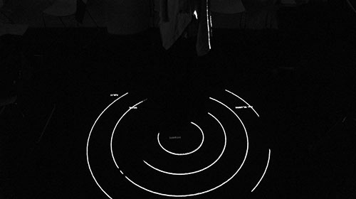

---

Mid-term Project

Combining Shader patterns with my thesis project that explores personal space. Using openframeworks, people are tracked and their invisible boundaries are visualized in real-time.

**Documentation** [https://vimeo.com/143921814](https://vimeo.com/143921814)

WIP: Other shader patterns 
